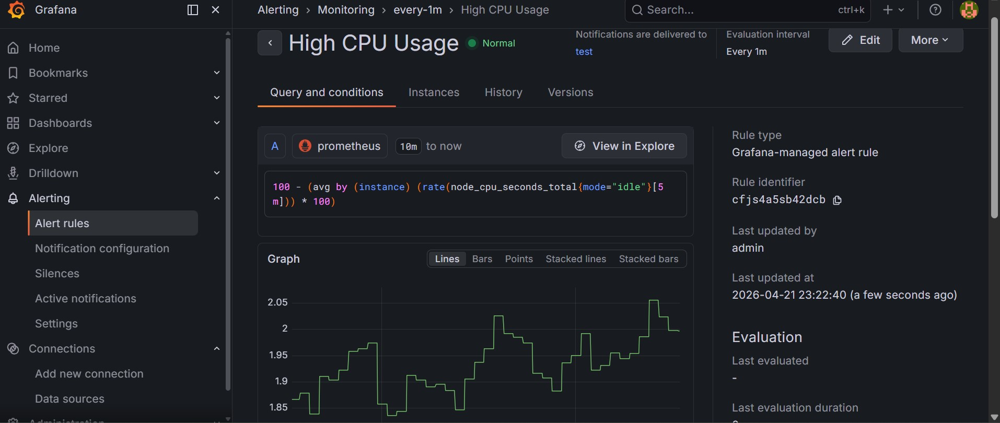
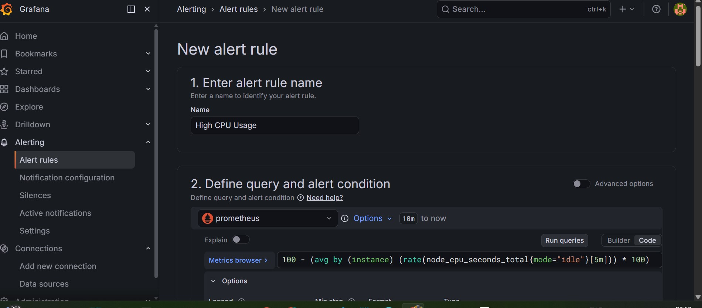
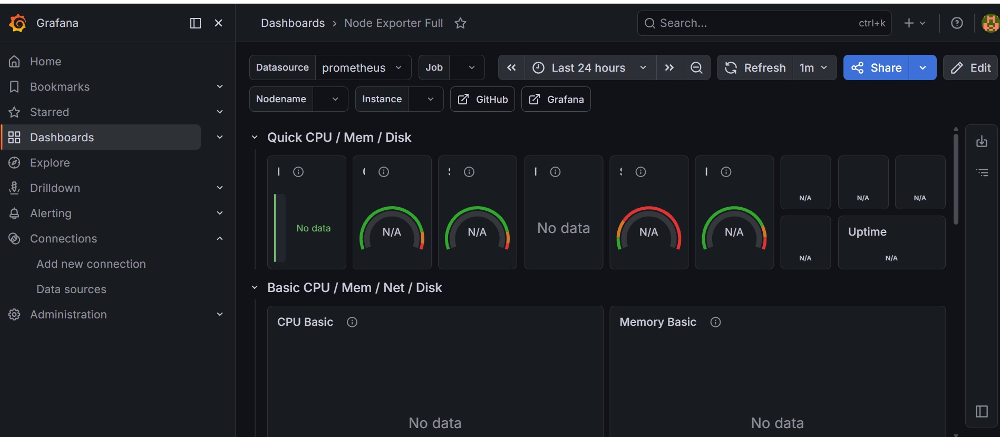

# Chapter 9: Monitoring Stack

## Prometheus + Grafana + Node Exporter

This project sets up a complete monitoring stack using Docker.

### Components

- **Prometheus** - Metrics collection (port 9090)
- **Grafana** - Visualization dashboard (port 3000)
- **Node Exporter** - System metrics exporter (port 9100)

### Screenshots

#### Grafana Dashboard (Node Exporter Full - ID: 1860)

#### PromQL Query - CPU Usage

#### Alert Rule - High CPU Usage (>80%)

### How to Run

docker-compose up -d

### Access Services

| Service | URL | Credentials |
|---------|-----|-------------|
| Grafana | http://localhost:3000 | admin / admin |
| Prometheus | http://localhost:9090 | - |

### PromQL Queries Used

# CPU Usage
100 - (avg by (instance) (rate(node_cpu_seconds_total{mode="idle"}[5m])) * 100)

# Memory Usage
(1 - (node_memory_MemAvailable_bytes / node_memory_MemTotal_bytes)) * 100

# Disk Usage
(1 - (node_filesystem_avail_bytes{mountpoint="/"} / node_filesystem_size_bytes{mountpoint="/"})) * 100

### Alert Rule

- Name: High CPU Usage
- Condition: CPU > 80% for 2 minutes
- Severity: Warning
